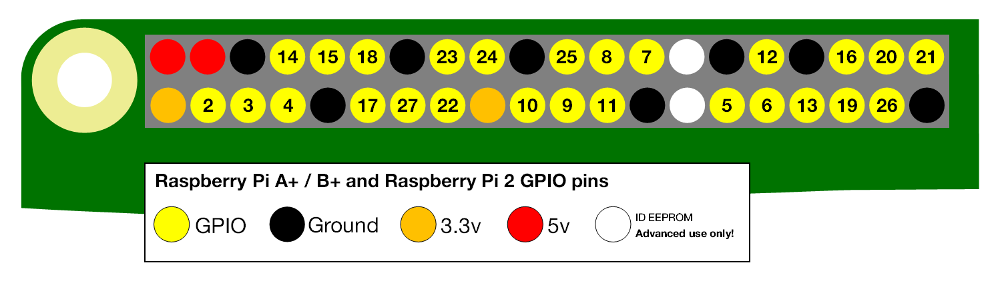
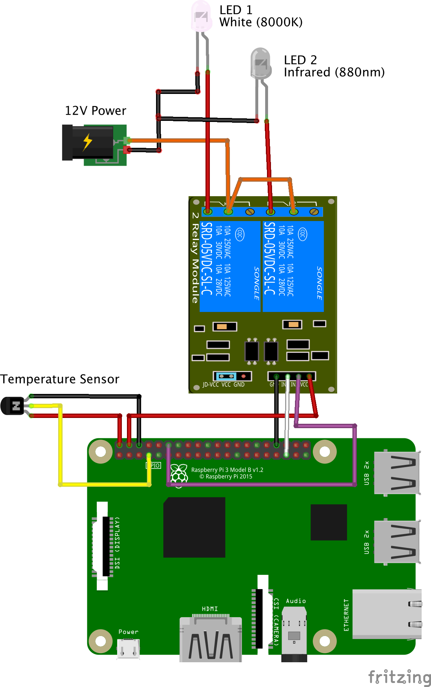
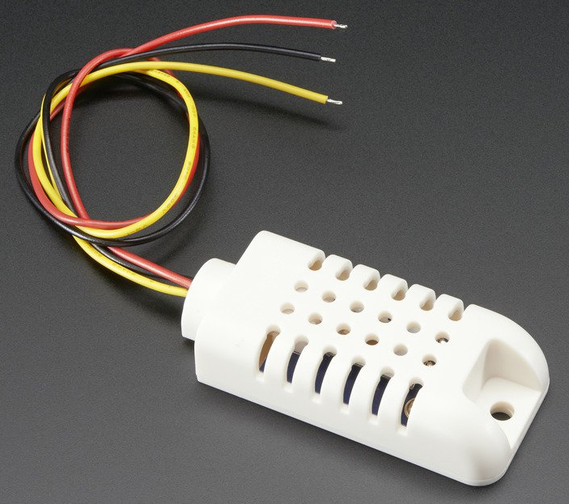

# Wiring a behavior box

Wiring a behavior box is fairly simple. The Pi needs to be wired to one end of a relay/switch, the other end of the relay/switch is wired to 12V DC, IR and white LEDs, and the temperature/humidity sensor is wired to the Pi.

## Raspberry Pi 2/3 pin out



There are multiple power and ground pins, use these to connect to the relay switch and the temperature sensor. Conceptually, all the ground pins are the same, you can use a [bread-board][bread-board] if you run out of ground pins or the wiring becomes too tangled.

## Wiring the camera

The Raspberry Pi [NoIR camera][noir-pi-camera] (and the [normal Pi camera][normal-pi-camera]) is connected to the Pi with a flat [ribbon cable][flat-camera-cable]. The length should not exceed 2 meters. The cable should have one side with a blue tab (one on each end). When connecting the cable to the camera and the Pi, the direction of the blue tab matters. If it is backwards, the camera will not function.

 - The blue side of the cable must go towards the back of the camera.
 - The blue side of the cable must go towards the ethernet and USB ports.

Finally, the camera must be activated from the command line using `sudo raspi-config` and choosing '5 Interface Options' then 'P1 Camera' and answering 'Yes'.

## Wiring diagram



## Lights

**Use an external 12V AC/DC power supply.** - Don't power the lights directly from the 5V pins on the Pi, the Pi does not have enough current. A >1 Amp 12V adapter should be fine. Don't worry, if it is under-powered, the LED lights will be a little dim.

**Use a relay switch.** - Never connect the 12V adapter directly to the Pi, instead use a relay switch. Only work with DC current coming out of the AC/DC adapter, **DO NOT** work with AC power coming from the wall as it can kill you.

The relay switch effectively separates the 5V, Ground, and GPIO on the Pi (left half of the relay) from the 12V power of the AC/DC adapter and the lights (right half of the relay). Here we will wire the system with the white LED on channel 1 and the IR LED on channel 2 of the relay switch. 

**All LEDs need resistors.** - All LEDs need a resistor, these are called 'current limiting resistor'. If you directly connect an LED to power and ground without a resistor, you will burn the LED.

The value of the resistor (in Ohms) needs to be calculated using [Ohms law](https://en.wikipedia.org/wiki/Ohm%27s_law), V=I*R. Where:

 - V (Volts) is determined by the power source
 - I (Amps) depends on the properties of each LED and if they are wired in series or in parallel
 - R (Ohms) is what needs to be calculated.
 
Follow [this](http://www.resistorguide.com/resistor-for-led/) tutorial to get started calculating the required resistor value. 

**Use IR LEDs <900 nm.** - These are within the sensitivity range of the Pi NoIR camera. A lot of IR LEDs are 940nm, these are not well suited for use with the Pi NoIR camera but are designed for IR sensors as is used in a TV remote.

## Wiring the lights 


### Connect a 12V AC/DC adapter, IR, and white lights to the two-channel relay switch.

 - Using a 12V AC/DC adapter (>1 Amp), cut the wire and stick the positive 'hot' wire into the center 'common' pin' of channel 1 on the relay switch. The 'hot' end wire usually has a white line down the length of the wire. You can also determine the 'hot' end using a multi-meter, it is the one that gives a positive (+) voltage when attached to the positive (normally red) end of the multi-meter.
 
 - Cut a bit of wire and connect the center 'common pin' of channel 1 to the center 'common pin' of channel 2. This is the 'hot' end.
 
 - Stick the positive end of the white LED into the 'normally closed' port of channel 1. Attach the negative end of the white LED to the 'ground' wire of the 12V AC/DC adapter. Remember, all LEDs need resistors!
 
 - Do the same for the IR LED. Stick the positive end into the 'normally closed' port of channel 2 on the relay switch. Attach the negative end of the IR LED to the 'ground' wire of the 12V AC/DC adapter. Remember, all LEDs need resistors!

 - Tie the three grounds together, this includes the ground from the 12V AC/DC adapter, the white LEDs and the IR LEDs.

### Connect the Pi to the relay switch switch

Connect 4 wires from the Pi to the relay switch. All these wires go on the opposite end from the 12V wires. Look at your relay switch for the correct connects, they are usually clearly labelled but can be in a different order from the image shown.

 - Connect a GPIO pin from the Pi to the 'In1=Digital Input' pin on the relay switch.
 - Connect a second GPIO pin from the Pi to the 'In2=Digital Input' pin on the relay switch.
 - Connect a 5V pin from the Pi to the 'Vcc' pin on the relay switch.
 - Connect a ground pin from the Pi to the 'GND' pin on the relay switch.
  
## Wiring a temperature and humidity sensor

The PiE server can log temperature and humidity using the DHT line of temperature sensors. To use these sensors, the [Adafruit Python sensor library][dht] needs to to be installed.

```
cd ~/pie
./install-dht
```

There are additional troubleshooting tips in the [pie/testing/][testing-folder] folder.




### [AM2302][AM2302]

Red is power, black is ground, and yellow is data.

 - Connect a 5V pin from the Pi to the red wire on the sensor.
 - Connect a ground pin from the Pi to the back wire on the sensor.
 - Connect a GPIO pin from the Pi to the yellow (data) pin on the sensor.


### [DHT22][dht22]

 - Connect a 5V pin from the Pi to the 'VCC' pin on the sensor.
 - Connect a ground pin from the Pi to the 'GND' pin on the sensor.
 - Connect a GPIO pin from the Pi to the 'DATA' pin on the sensor.


[bread-board]: https://www.adafruit.com/product/64
[am2302]: https://www.adafruit.com/product/393
[camera-cable]: https://www.adafruit.com/product/2144
[normal-pi-camera]: https://www.adafruit.com/product/3099
[noir-pi-camera]: https://www.adafruit.com/product/3100
[dht22]: https://www.adafruit.com/product/385
[dht]: https://github.com/adafruit/DHT-sensor-library
[testing-folder]: https://github.com/cudmore/pie/tree/master/testing