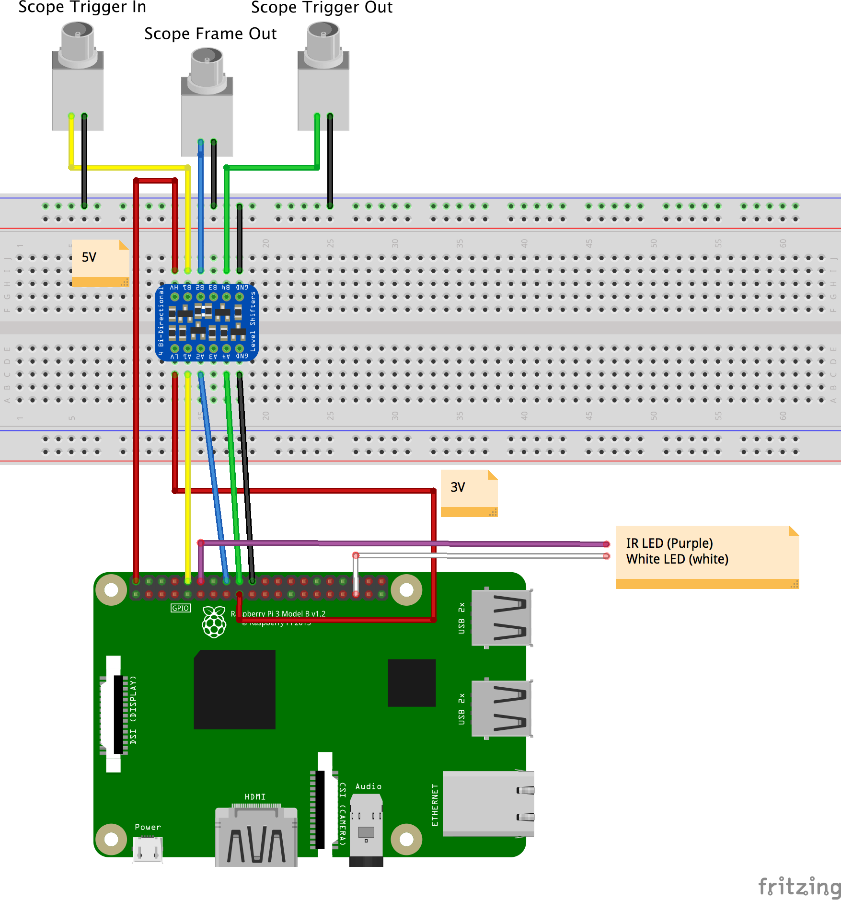

# Wiring a scope

This is a tutorial for wiring tactile-push-buttons to trigger a `frame` and a `trigger-in` in a PiE server.

This tutorial requires:

 - A [breadboard][bread-board].
 - Some [jumper wires][jumper-wires].
 - Two [tactile push buttons][push-button].
 - A functioning Raspberry Pi.
 - A [PiE server][pie-server] to be installed.

### Raspberry Pi 3 pin out

Here is a schematic of the Raspberry Pi 2/3 pin outs. Red is 5V, orange is 3.3V, yellow are GPIO, black are Ground, and white should not be used.


Important: The Raspberry Pi GPIO pins are **not** 5V tolerant. Never connect a 5V line to a Raspberry GPIO pin.

## 1) Test the PiE server 'frame' pin with a tactile-button-switch

Here, we will wire a tactile-button-switch to the the Raspberry Pi 3.3V line and the PiE `frame` pin (GPIO 18) to test that pushing the button registers a `frame` in the PiE server. This button will normally sit at `LOW` and take on a '3.3V ' level when pushed.

- 1) Wire the Raspberry Pi 3.3V pin to the '+' rail on a breadboard (red).

- 2) Insert a [Tactile-button-switch][push-button] on the breadboard.

- 3) Connect the **top-left** pin of the Tactile-button-switch to the '+' rail on the breadboard (red).
- 4) Connect the **top-right** pin of the Tactile-button-switch to the Raspberry Pi `GPIO 23`.
- 5) The remaining **bottom-left** and **bottom-right** pins on the tactile-button-switch should **not** be connected to anything.

Make sure the PiE server is running with `./pie run` so we can see the output in the terminal.

```
cd ~/pie
./pie stop # stop any background PiE servers
./pie run # run the PiE server on the command line
```

In the 'Pins' section, configure the triggerIn pin to Polarity 'rising' and Pull Up/Down to 'down'. Do the same for the 'frame' pin.


Make sure 'Allow arming' is checked in the Configure section.

Push the `frame` tactile-button-switch and you should see see something like this on the command line:

```
!!! received frame when not running
```

### If you do see this

Good. Your `frame` pin is working.

### If you **do not** see this

**STOP** your `frame` pin is **not** working. Please check your wiring and try again.


## 2) Test the PiE server 'trigger-in' pin with a tactile-button-switch

Here, we will wire a tactile-button-switch to the Raspberry Pi 3.3V line and the PiE 'triggerIn' pin (GPIO 23) to test that pushing the button starts a 'trial' in the PiE server. This push-button will normally sit at `LOW` and take on a '3.3V' level when pushed.

- 1) Wire the Raspberry Pi 3.3V pin to the '+' rail on a breadboard (red).

- 2) Insert a [Tactile-button-switch][push-button] on the breadboard.

- 3) Connect the **top-left** pin of the Tactile-button-switch to the '+' rail on the breadboard (red).
- 4) Connect the **top-right** pin of the Tactile-button-switch to the Raspberry Pi `GPIO 24`.
- 5) The remaining **bottom-left** and **bottom-right** pins on the tactile-button-switch should **not** be connected to anything.

Make sure the PiE server is running with `./pie run` so we can see the output in the terminal.

```
cd ~/pie
./pie stop # stop any background PiE servers
./pie run # run the PiE server on the command line
```

Make sure 'Allow arming' is checked in the Configure section.

Push the `trigger-in` tactile-button-switch and you should see something like this on the command line:

```
!!! received triggerIn_Callback() when camera is NOT armed
```

### If you do see this

Good. Your `trigger-in` pin is working.

### If you **do not** see this

**STOP** your `trigger-in` pin is **not** working. Please check your wiring and try again.

### Once your trigger-in pin and tactile-button-switch are working

Go into the web interface and `arm` the recording with the arm checkbox.

Push the `trigger-in` tactile-button-switch and video should start recording and you should see this in the command prompt:

```
[2018-07-09 08:48:26,556] {bTrial.py startTrial:702} DEBUG - startTrial startArmVideo=True
[2018-07-09 08:48:26,559] {bTrial.py startTrial:721} INFO - triggerOut pin:15 value:True
```

Then, while the recording is still going, push the `frame` tactile-button-switch and you should see

```
[2018-07-09 08:49:08,884] {bTrial.py eventIn_Callback:614} DEBUG - eventIn_Callback() frame 1
[2018-07-09 08:49:09,027] {bTrial.py eventIn_Callback:614} DEBUG - eventIn_Callback() frame 2
[2018-07-09 08:49:09,312] {bTrial.py eventIn_Callback:614} DEBUG - eventIn_Callback() frame 3
```

Once you done this for awhile, click the disk icon in the top tool-bar and view your videos and trial .txt files. Your videos should be watermarked with frame numbers and the .txt file should log the frame times. You will see two video files per trial, a before and after video. The after video is started when a trial is started, the before video is a 'pre-trigger' video whose length is set with 'Pre Trigger Buffer (sec)'. 

## 3) Connecting triggerIn, triggerOut, and frame pins to a scope.

Following the same logic, we can connect the Raspberry Pi `triggerIn` to the 'Scope Trigger Out', the Raspberry `triggerOut` to the 'scope Trigger In', and the Raspberry Pi `frame` in pin to the 'Scope Frame Out'. Keep in mind that the definition of 'in' versus 'out' is with respect to the device you are talking about.

Important: The Raspberry Pi GPIO pins are **not** 5V tolerant. Never connect a 5V line to a Raspberry GPIO pin. We use a level-shifter to convert high voltage 5V to 3V.

If your scope sends a rising `high` pulse for 'trigger out' and 'frame out' you can follow steps #1 and #2 above. If your scope sends a falling `low` pulse for either of these, you need to configure the 'pins' section of the web interface as polarity `falling` and Pull Up/Down as `up`.

### Raspberry Pi as the master (Scope is slave)

To have the PiE server trigger your scope (Raspberry Pi is master), use the Raspberry `triggerOut` pin. In the web interface, if the 'Default Setting' for the `triggerOut` pin is set to 'false' then the PiE server will hold this pin `LOW` and send a 'positive' `HIGH` pulse when you click 'Start Trial'. The opposite is also true, if the 'Default Setting' for the `triggerOut` pin is set to 'true', the PiE server will hold this pin `HIGH` and send a `LOW` pulse when you click 'Start Trial'. You need to figure out what signal your scope is expecting for a trigger, it is either `HIGH` or `LOW`.

### Raspberry Pi as the slave (Scope is master)

To have your scope trigger the PiE server (Scope is master), use the Raspberry `triggerIn` pin. In the web interface you 'arm' the Raspberry to 'wait for trigger' using the 'arm' checkbox.

### Troubleshooting

If you run into trouble it is best to independently test each component of the system. In this case, you would use a volt-meter to test the signals coming off your scope are what you expect.

### Wiring diagram



[push-button]: https://www.adafruit.com/product/367
[bread-board]: https://www.adafruit.com/product/64
[jumper-wires]: https://www.adafruit.com/?q=jumper%20wires
[pie-server]: https://github.com/cudmore/pie
[raspberry-pi]: https://www.raspberrypi.org/

