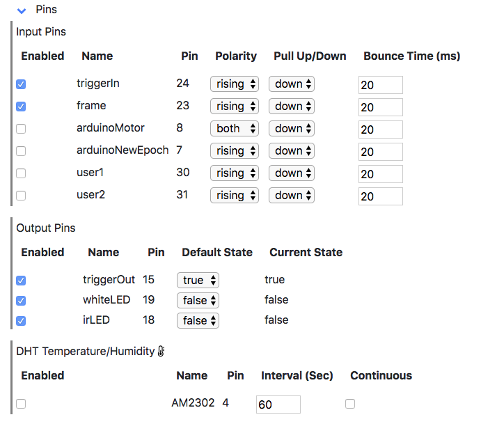

## Web interface

<table><tr><td>

</td></tr></table>

The top row displays the PiE server hostname, IP, and current date and time. If the server is running, the time will be updated each second. In addition, there are links to recorded video files, server logs, environmental sensors, and web help.

**White and IR Switches**. Will turn White and IR lights on and off. This is not allowed when 'Configure - Auto Lights' is on.

**ID and Condition**. These will be pre-pended to all saved file names. Leave them blank and nothing will be added. This is useful to organize your saved files with an animal ID and condition.

**Start Recording**. Will start a video recording following 'Repeat Forever', 'Number of Repeats' and 'Repeat Duration'. These parameters can be set and saved in the 'Configure' section. 

**Streaming**. Will start streaming the camera to the web page. If the stream fails to start the first time, try turning it off and then on again.

**Arm**. When checked, the PiE server will wait for an input trigger (Input Pins - triggerIn - GPIO 24). Turning 'Arm' on will force 'Repeat Forever' off and 'Number of Repeats' to 1. Arming is only available when 'Config - Allow Arming' is on. When 'Arm' is on and an input trigger is received, a pre-trigger video recording will be saved following 'Configure - Pre Trigger Buffer (sec)'.

**Last Action**. Is updated with the last action the PiE server took. This is normally updated in response to clicking interface buttons.

## Configure

<table><tr><td>

</td></tr></table>

The Configure section allows parameters of the PiE server to be set. Current parameters can be saved with 'Save Defaults' and parameter pre-sets can be loaded.

**Repeat Forever**. When checked, 'Start Recording' will record videos of 'Repeat Duration' over and over until 'Stop Recording' is pressed. When 'Arm' is on, this will be turned off.

**Number of Repeats**. The number of video files to record when 'Start Recording' is pressed. Each video file will have a duration set by 'Repeat Duration Sec)'. When 'Arm' is on, this will be set to 1.

**Repeat Duration (sec)**. The length of each video file in seconds.

**Auto Lights**. When checked, the White and IR lights will be turned on and off to simulate daytime and nighttime. The white light will be on between sunrise and sunset, the IR light will be on otherwise.

**Sunrise (hour) and Sunset (hour)**. When 'Auto Lights' is on, the White and IR lights will be turned on and off to simulate daytime and nighttime.

**FPS**. Specifies the frames-per-second (FPS) or recorded video. Minimum is 1 and maximum is 90.

**Resolution**. Specifies the resolution of recorded video.

**Stream Resolution**. Specifies the resolution of streaming video.

**Capture Still and Still Interval (Sec)**. If on, still images will be captured at 'Still Interval (Sec)'. These still images can be viewed in real-time in the 'Last Still Image' section.

**Pre Trigger Buffer (sec)**. Used for 'Armed' recording. Specifies the duration of video recording before each trigger.

**Trial Number**. Allows the trial number to be manually set. The trial number is always automatically incremented each time 'Start Recording' or 'Start Trial' are initiated.

**Include Hostname**. If checked, the hostname will be pre-pended to each saved video file.

**Allow Arming**. If on, will expose the 'Arm' interface. This assumes the PiE server has been wired to a trigger in and optionally a microscope frame-clock.

**Use Serial**. If on, will expose the 'Motor' interface. This assumes a Teensy microcontroller is attached via usb.

**Load**. Buttons to load sets of configuration parameters. This includes the last configuration saved with 'Save Defaults' as well as pre-defined configuration parameters. It is easy and intuitive to specify your own sets of configuration parameters and use 'Save Defaults' exclusively.

 - **Defaults**. Load the last configuration saved with 'Save Defaults'.
 - **Homecage**. Auto lights on, arm off, serial off.
 - **Scope**. Arm on, serial off.
 - **Treadmill**. Arm on, serial on.
 - **User**. User specified configuration file.
 - **Factory Defaults**.  Reset the PiE server to its factory default configuration.

## Pins

<table><tr><td>

</td></tr></table>

The Pins section allows GPIO pin parameters to be specified. The `triggerIn` and `frame` pins are used during armed recording and their parameters need to be set to match the signals coming off your particular hardware/scope. For example, if your scope outputs a `rising` trigger then `triggerIn` should be set to Polarity `rising` and Pull Up/Down `down`.

All parameters in the 'Pins' section will be save with 'Config - Save Defaults'.

**Note**. To change 'Pin' numbers, the config json files need to be manually edited.

## Motor

<table><tr><td>

</td></tr></table>

The Motor section allows parameters to be uploaded to a Teensy microcontroller. This is only for advanced users.