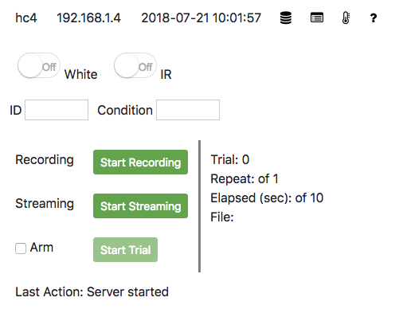
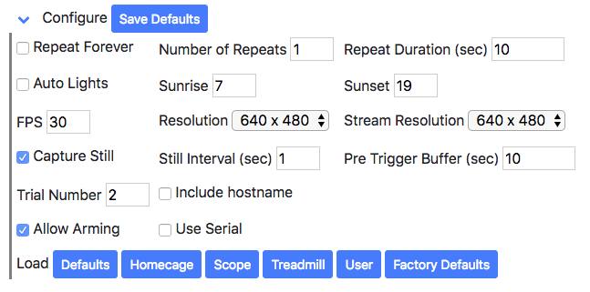
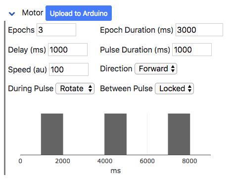
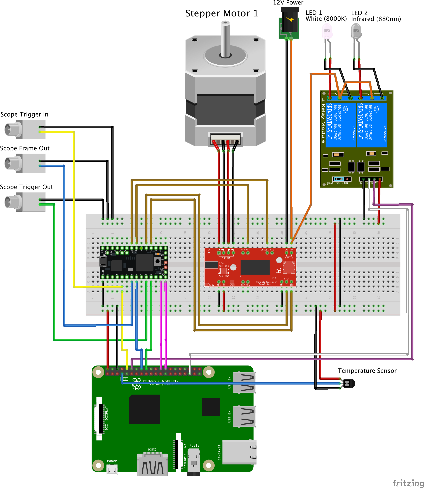

# Raspberry Pi Controlled Experiment (PiE)

## This is a work in progress and is updated daily. If you are interested in using this code, please email robert.cudmore@gmail.com

A web server to control an experiment to record video and optionally control a motorized treadmill.

#### Features

 - Video recording
 - Video streaming to a browser
 - Trigger video recording with general-purpose-input-output (GPIO)
 - Watermark video with incoming GPIO events including frame numbers
 - Control a motor during video recording (requires Teensy microcontroller and a stepper motor)
 - Saves all events into an easy to parse text file

#### System Requirements (video)

 - Raspberry Pi 2/3
 - Raspberry Pi Camera

#### System Requirements (home cage video)
 
 - Raspberry Pi 2/3
 - Raspberry Pi Camera
 - 2 channel relay
 - IR LEDs
 - White LEDs
 - Temperature/Humidity sensor
 
#### System Requirements (on scope video)

 - Raspberry Pi 2/3
 - Raspberry Pi Camera
 - Level shifter
 
#### System Requirements (treadmill)

 - Raspberry Pi 2/3
 - Raspberry Pi Camera
 - Teensy microcontroller
 - Stepper motor controller
 - Stepper motor
 
## Disclaimer

This repository is working in my hands but may not in yours. Please email with questions or better yet, open an [issue](https://github.com/cudmore/pie/issues). If this code is used in any way, please be a good scientist/colleague and give me credit.

## Get a functioning Raspberry Pi

We assume you have a functioning Raspberry Pi. To get started, see our [installation][install-stretch] recipe.

## Download

	# update your system
	sudo apt-get update
	sudo apt-get upgrade

	# if you don't already have git
	sudo apt-get install git
	
	# clone the main PiE repository
	git clone https://github.com/cudmore/pie.git
	
## Install the PiE server

	cd ~/pie
	./install-pie

Thats it, the PiE server should be running and you can use the web interface at `http://[ip]:5010`. Where `[ip]` is the IP address of your Raspberry Pi. Make sure you specify port `5010` in the web address.

## Install extras

Install [uv4l][uv4l] for video streaming.

	cd ~/pie
	./install-uv4l

Install the [DHT temperature/humidity sensor Python library][dht] (optional)

	cd ~/pie
	./install-dht

## Running the PiE server (details)

The [pie/install-pie](install-pie) script installs a system service allowing the PiE server to run in the background. This background PiE server can be controlled as follows:

```
cd ~/pie
	
./pie start    - start background PiE server"
./pie stop     - stop background PiE server"
./pie status   - check the status of background PiE server"

./pie enable   - enable background PiE server at boot"
./pie disable  - disable background PiE server at boot"

./pie run      - run PiE server on command line"
```

For debugging, use `./pie run` to print the status of the server to the command line. In all cases, when the PiE server is running it will provide a web interface on port `5010`. To access the website, point a browser to `http://[ip]:5010`.

## Web interface

See the [web interface readme](readme-web.md) for more information.

### Main

The 'Start Recording' and 'Start Trial' buttons start video recording to a file. All files are saved in `/video`. At the end of each video file, a trial file is also saved. Trial files are plain text files with a record of 'events' that occurred during the video recording. See the [trial file readme](readme-trial-file.md) for more information.
 
<table><tr><td>

</td></tr></table>

### Config

<table><tr><td>

</td></tr></table>

### Motor

<table><tr><td>

</td></tr></table>

## Parts list

See the complete [parts list](readme-parts.md) for more information.

### Raspberry Pi

The [Raspberry Pi][raspberry-pi] is a complete computer system in an almost credit card size. It has ethernet, usb, general-purpose-input-output pins (GPIO), a dedicated camera port, and runs a version of Debian Linux called [Rasbian][raspbian]. You can pick up the current model, a [Raspberry Pi 3 Model B+][buy-raspberry-pi].

### Raspberry Pi Camera

The Raspberry Pi has a dedicated camera port for the Raspberry Pi Camera. This is an 8 megapixel camera capable of frame rates as high as 90 frames-per-second and comes in two flavors, the [Pi NOIR Camera][raspberry-pi-noir] which can capture images/video using infrared (IR) lights and the '[normal][raspberry-pi-camera]' camera which can capture images/video using visible (white) light. We generally use the [Pi NOIR][raspberry-pi-noir] version to record video in behavior boxes during both the daytime (white LEDs) and night-time (IR LEDs) as well as on the scope to record video during two-photon imaging in the dark using IR LEDs.

### Level shifter

If you need to connect the Raspberry Pi directly to 5V TTL lab equipment you **need** a [level shifter][level-shifter] to convert the 5V signal to 3V as the Raspberry Pi is only 3V tolerant. We normally use [Adafruit level shifters][adafruit-level-shifter].

### Two channel relay

A [relay][relay] is a switch allowing you to turn higher voltage devices (usually LEDs connected to 12V power) on and off with 3V DIO pins. We are using a [sainsmart 2-channel relay][sainsmart-relay].

### Teensy microcontroller

We are using [Teensy 3.2 or 3.5][teensy] microcontrollers. They are Arduino compatible but have a lot more features. These microcontrollers can be programmed from the command line using [platformio][platformio]. No need for the Arduino IDE. The Raspberry Pi first needs a few simple system wide configurations, see the readme in [pie/platformio](platformio/). 

### Stepper motor and  driver

We are using a [Bipolar stepper motor][steppermotor] with the [Easy Driver motor driver][easydriver] from Sparkfun.

## Wiring the system

#### Option 1: Recording homecage video
 
 - Wire a 2-channel relay with white and IR LEDs connected to 12V power.
 - Wire a Temperature/Humidity sensor like the [AM2302][am2302].
    
#### Option 2: Record video on a scope (no Teensy)

 - Please see the [scope wiring tutorial](readme-scope.md).
 - Wire a level shifter connected to `Scope Trigger In`, `Scope Trigger Out`, and `Scope Frame out`.
  
#### Option 3: Record video on a scope and use a Teensy and a motorized treadmill

 - Wire a Teensy connected to `Scope Trigger In`, `Scope Trigger Out`, and `Scope Frame out`.
 - Wire a stepper motor and motor controller.
 
### Important

 - The Raspberry Pi is **NOT** 5V tolerant. Connecting standard lab equipment using 5V TTL pulses can damage the Pi. These 5V lines can be converted to 3V with a [dedicated level shifter][adafruit-level-shfter]. Or, if you are using a Teensy, these 5V lines can pass through the Teensy which **IS** 5V tolerant but then outputs 3V which can go into the Raspberry Pi. In this way, the Teensy can act as a programmable [level shifter][level-shifter].
 
 - The Easy Driver Motor Driver has a nasty feature. If you connect the 12V line to the board, the Stepper motor **must** be plugged in or else you will fry the driver board. Thus, check the stepper motor is connected before plugging in the 12V line and check the 12V line is not plugged in before disconnecting the stepper motor.

 
### Wiring diagram

This is a full wiring diagram for option #3, recording video on a scope using a Teensy with a motorized treadmill. To wire a Raspberry Pi to a scope, please see the [scope wiring tutorial](readme-scope.md). This wiring diagram is made with [Fritzing][fritzing], download the [pie.fzz](docs/img/pie.fzz) file.



### Pin table

This table shows all the pin connections for option #3. To wire a Raspberry Pi to a scope without a Teensy (option #2), make sure you connect the Raspberry Pi `triggerOut`, `frame`, and `triggerIn` pins to a level-shifter and then to the scope. See the [scope wiring tutorial](readme-scope.md) for details.

[Download pdf](docs/img/pie_pins.pdf) of this table.

|   |  | **Scope** | **Other Devices** | **Raspberry** |  |  |  |  | **Teensy** |  |  |  |  | **Motor Controller** |  |
|  ------ | ------ | ------ | ------ | ------ | ------ | ------ | ------ | ------ | ------ | ------ | ------ | ------ | ------ | ------ | ------ |
|  **Category** | **Ground** | **Description** |  | **Description** | **Config FIle** | **Pin #** | **Input** | **Output** | **Description** | **Config FIle** | **Pin #** | **Input** | **Output** | **Pin** |  |
|   |  |  |  |  |  |  |  |  |  |  |  |  |  |  |  |
|  Raspberry Ground | X |  |  | Gnd |  | Gnd |  |  |  |  |  |  |  |  |  |
|   |  |  |  |  |  |  |  |  |  |  |  |  |  |  |  |
|  Scope Ground | X |  |  |  |  |  |  |  |  |  |  |  |  |  |  |
|  Scope Trigger In |  | Trigger In (5V) |  | triggerOut | hardware.eventOut[0].pin | 15 |  | X | startTrialPin | treadmill.cpp | 3 | X |  |  |  |
|  Scope Trigger Out |  | Trigger Out (5V) |  |  |  |  |  |  | extTriggerInPin | treadmill.cpp | 8 | X |  |  |  |
|   |  |  |  | triggerIn | hardware.eventIn[0].pin | 24 | X |  | passThroughExtTriggerInPin | treadmill.cpp | 9 |  | X |  |  |
|  Scope Frame Out |  | Frame Out (5V) |  |  |  |  |  |  | framePin | treadmill.cpp | 5 | X |  |  |  |
|   |  |  |  | frame | hardware.eventIn[1].pin | 23 | X |  | passThroughFramePin | treadmill.cpp | 6 |  | X |  |  |
|   |  |  |  |  |  |  |  |  |  |  |  |  |  |  |  |
|  LEDs |  |  | LED 1 (+) | whiteLED | hardware.eventOut[1].pin | 19 |  | X |  |  |  |  |  |  |  |
|   | X |  | LED 1 (-) |  |  |  |  |  |  |  |  |  |  |  |  |
|   |  |  | LED 2 (+) | irLED | hardware.eventOut[2].pin | 18 |  | X |  |  |  |  |  |  |  |
|   | X |  | LED 2 (-) |  |  |  |  |  |  |  |  |  |  |  |  |
|   |  |  |  |  |  |  |  |  |  |  |  |  |  |  |  |
|  DHT Sensor |  |  | data (yellow) | dhtSensor | hardware.dhtSensor.pin | 4 | X |  |  |  |  |  |  |  |  |
|   |  |  | 5V (red) |  |  | 5V |  |  |  |  |  |  |  |  |  |
|   | X |  | Gnd (black) |  |  |  |  |  |  |  |  |  |  |  |  |
|   |  |  |  |  |  |  |  |  |  |  |  |  |  |  |  |
|  Stepper Motor | X |  |  |  |  |  |  |  |  |  |  |  |  | Gnd |  |
|   |  |  |  |  |  |  |  |  | motorStepPin | treadmill.cpp | 17 |  | X | Step |  |
|   |  |  |  |  |  |  |  |  | motorDirPin | treadmill.cpp | 16 |  | X | Dir |  |
|   |  |  |  |  |  |  |  |  | motorResetPin | treadmill.cpp | 19 |  | X | RST |  |
|   |  |  |  |  |  |  |  |  | motorEnabledPin | treadmill.cpp | 20 |  | X | Enable |  |
|   |  |  |  |  |  | 5V |  |  |  |  |  |  |  | 5V (+) |  |
|   | X |  |  |  |  |  |  |  |  |  |  |  |  | Gnd |  |
|   |  |  | 12V DV (+) |  |  |  |  |  |  |  |  |  |  | PWR In (M+) |  |
|   | X |  | 12V DC (Gnd) |  |  |  |  |  |  |  |  |  |  | PWR In (Gnd) |  |
|   |  |  |  | arduinoMotor | hardware.eventIn[2].pin | 8 | X |  | motorOnPin | treadmill.cpp | 11 |  | X |  |  |
|   |  |  |  | arduinoNewEpoch | hardware.eventIn[3].pin | 7 | X |  | newEpochPin | treadmill.cpp | 12 |  | X |  |  |
|   |  |  |  |  |  |  |  |  |  |  |  |  |  |  |  |
|  Rotary Encoder |  |  | Encoder 1 |  |  |  |  |  | encoderPinA | treadmill.cpp | 15 | X |  |  |  |
|   |  |  | Encoder 1 |  |  |  |  |  | encoderPinB | treadmill.cpp | 16 | X |  |  |  |
|   |  |  | Encoder 1 (+5V) |  |  |  |  |  |  |  | 5V |  |  |  |  |
|   | X |  | Encoder 1 (Gnd) |  |  |  |  |  |  |  |  |  |  |  |  |
|   |  |  |  |  | ??? |  | X |  | encoderOutPin | treadmill.cpp | 10 |  | X |  |  |
|   |  |  |  |  |  |  |  |  |  |  |  |  |  |  |  |
|  Emergency Stop Button |  |  | Push button (+3V) | ??? | ??? | ??? | X |  | emergencyStopPin | treadmill.cpp | 20 | X |  |  |  |
|   | X |  | Push button (Gnd) |  |  |  |  |  |  |  |  |  |  |  |  |

## Manually editing user config

The PiE server comes with three default sets of options: Homecage, Scope, and Treadmill. There is an additional `User` configuration that can be edited manually to configure the PiE server.

To edit the `User` file, open [pie_app/config/config_user.json](pie_app/config/config_user.json). The format of the file is [json][json] and basically specifies key/value pairs. Do not add or remove any keys, just change their values. The json format is very strict, if there are any syntax errors, the file will not load and the PiE server will not run.

To check your work, use

```
cd ~/pie/pie_app/config
cat config_user.json | python -m json.tool
```

If your edits are syntatically correct, this command will output the contents of the file. If you have created an error, they will be reported on the command line. For example, if your forget a comma  after `"enabled": true` like this

```
        "triggerIn": {
            "enabled": true
            "pin": 23,
            "polarity": "rising",
            "pull_up_down": "down"
        },
```

You will get an error

```
Expecting , delimiter: line 27 column 13 (char 648)
```

## GPIO timing

The Raspberry Pi is running a complex operating system which provides many features including usb ports, an ethernet interface, and hdmi output. Thus, there will be delays in receiving and generating digital input and output (DIO). 

The PiE server uses the Raspberry [GPIO][gpio] python package by default and will use the [pigpio daemon][pigpiod] if it is installed and running. The GPIO package has a jitter of approximately +/- 2 ms for all DIO with occasional, < 1%, events having absurd jitter on the order of 100 ms. This includes trigger in, frame in, and any output. If you are using the PiE server to record video this should be fine. If you want more precision, either offload your timing critical tasks on a Teensy or use the Raspberry [pigpiod][pigpiod] daemon.

See the Jupyter notebooks in the [analysis/](analysis/) folder for a comparising of frame arrival times using GPIO versus pigpio.

### Download and install pigpio

```
cd
rm pigpio.zip
sudo rm -rf PIGPIO
wget abyz.me.uk/rpi/pigpio/pigpio.zip
unzip pigpio.zip
cd PIGPIO
make
sudo make install
```

### To start the pigpio daemon

    sudo pigpiod

### To stop the pigpio daemon

    sudo killall pigpiod

## Troubleshooting

### Running the PiE server at boot

```
# To make the background server run at boot
./pie enable

# To make the background server NOT run at boot
./pie disable
```

### Running the PiE server on the command line

The PiE server is run as a background system service following installation with `./install-pie` and can be controlled with `./pie start` and `./pie stop`. Specifically, the PiE server is using `systemctl` which is a subset of [systemd][systemd]. If the PiE server is not running correctly, it can be run directly on the command line using `./pie run`.

```
# Make sure the background PiE server is stopped
cd ~/pie
./pie stop

# Run the PiE server and output logs to the command line window
# Once running, use ctrl+c to stop the server
./pie run

# To start the background server again
./pie start
```

### Manually running the PiE server

Normally, the PiE server will run in the background after installation with '~/pie/install-pie'. If there are errors during the install or the PiE server is not running, the pie server can be run manually as follows.

```
# stop background pie server
cd ~/pie
./pie stop

# (optional) if neccessary, install virtualenv
sudo apt-get -qy install python-virtualenv

# (optional) if you do not have 'pie_env/bin/activate' then manually make the virtual environment
mkdir pie_env
virtualenv -p python3 --no-site-packages pie_env

# activate pie server virtual environment in pie_env/
# Once activated, the command prompt should start with (pie_env)
cd ~/pie
source pie_env/bin/activate

# finally, manually run the pie server
cd ~/pie/pie_app
python treadmill_app.py

```

### Uninstalling the PiE server

Use the uninstall script `./uninstall-pie` and remove the ~/pie folder with `sudo -Rf ~/pie`. The uninstall script does the following

```
# stop
echo "=== stopping PiE server and Admin server"
sudo systemctl stop treadmill.service
sudo systemctl stop pieadmin.service

# disable
echo "=== disabling services"
sudo systemctl disable treadmill.service
sudo systemctl disable pieadmin.service

# remove
echo "=== removing files in /etc/systemd/system/"
sudo rm /etc/systemd/system/treadmill.service
sudo rm /etc/systemd/system/pieadmin.service

echo "==="
echo "PiE server and admin server have been uninstalled"
echo "You can now remove the PiE server folder with 'sudo rm -Rf ~/pie'"
echo "You can fetch a new copy with 'cd; git clone https://github.com/cudmore/pie.git"
```

### Full reinstall of the PiE server

Issue these commands to remove and reinstall the PiE server. As always, be careful of using 'sudo'.

```
cd
sudo rm -Rf pie
git clone https://github.com/cudmore/pie.git
cd pie
./install-pie
```

### Troubleshooting the camera

Capture a still image with the Pi camera with `raspistill -o test.jpg`

```
raspistill -o test.jpg
```

If you get any errors then there is a problem with the Pi Camera.

Make sure the Pi Camera is activated.

```
# type this at a command prompt
sudo raspi-config

# select '5 Interface Options'
# select 'P1 Camera'
# Answer 'Yes' to question 'Would you like the camera interface to be enabled?'
```

### Checking if uv4l (Streaming) is running

In rare instances the [uv4l][uv4l] streaming server does not stop properly. Streaming with uv4l runs at the system level and not in Python. As such, uv4l needs to be controlled via the command line.

```
#list all uv4l processes
ps -aux | grep uv4l

# will yield something like
root     23117  9.8  1.3 140796 12312 ?        Ssl  20:34   0:02 uv4l --driver raspicam --auto-video_nr --encoding h264 --width 640 --height 480 --enable-server on
pi       23262  0.0  0.1   6644  1316 pts/1    S+   20:34   0:00 grep --color=auto uv4l

# kill uv4l with its process id (PID)
# '--' is needed to kill parent and child processes
sudo kill -- 23117

#check the uv4l process is no longer running
ps -aux | grep uv4l

# should yield
pi         674  0.0  0.1   6644  1320 pts/0    S+   21:06   0:00 grep --color=auto uv4l
```

#### uv4l will not go away

Worst case senario is `ps -aux | grep uvl4` yields something like this

```
root     23117 17.2  0.0      0     0 ?        Zsl  20:34   0:37 [uv4l] <defunct>
```

If you see the `<defunct>` then restart the Pi with `sudo reboot` and it should be fixed.

### Converting video

The PiE server uses [libav (avconv)][libav] to convert video from .h264 to .mp4. If labav (avconv) does not install during `~/pie/install-pie`, this conversion will not work.

## Working versions

Here is a snapshot of versions for a working PiE server as of August 8, 2018. As python packages are updated, things can potentially break.

```
cd ~/pie
source pie_env/bin/activate
pip freeze
```

```
# returns
click==6.7
dnspython==1.15.0
eventlet==0.24.1
Flask==1.0.2
Flask-Cors==3.0.6
Flask-SocketIO==3.0.1
greenlet==0.4.14
itsdangerous==0.24
Jinja2==2.10
MarkupSafe==1.0
monotonic==1.5
picamera==1.13
pigpio==1.40.post1
pkg-resources==0.0.0
pyserial==3.4
python-engineio==2.2.0
python-socketio==2.0.0
RPi.GPIO==0.6.3
six==1.11.0
Werkzeug==0.14.1
```

```
python --version
```

```
# returns
Python 3.5.3
```

```
cat /etc/os-release
```

```
# returns
PRETTY_NAME="Raspbian GNU/Linux 9 (stretch)"
NAME="Raspbian GNU/Linux"
VERSION_ID="9"
VERSION="9 (stretch)"
ID=raspbian
ID_LIKE=debian
```

```
uname -a
```

```
# returns
Linux workpi 4.14.50-v7+ #1122 SMP Tue Jun 19 12:26:26 BST 2018 armv7l GNU/Linux
```

## Common errors

### bCamera PiCameraMMALError: Failed to enable connection: Out of resources

If you receive this error in the web interface or logs, it means the camera is in use by some other process. The Raspberry camera can only do one thing at a time, it can stream or record but not both at the same time. In addition, the camera can not record (or stream) in two different programs simultaneously.

Make sure other programs are not using the camera and try again. Rebooting with 'sudo reboot' usually does the trick unless these programs, like the PiE server, are set up to run at boot.


### OSError: [Errno 98] Address already in use

This happens when you try and start the server but it is already running. Usually when it is running in the background and you run it again with `./pie run`. Just stop the server with `./pie stop` and then try again with `./pie run`.

## To Do

 - Make sure streaming stops when browser tab is closed or browser is quit.
 - Expand sunrise/sunset to fractional hour.
 - [partially done 20180831] Add warning when video/ drive space remaining is less than 1 GB. Do this by updating status.trial.systemInfo.gbRemaining at the end of each recording (record video thread, and armed recording thread).

	I am doing this with hard-coded 5GB warning in index.html, see:
 	ng-if="videoArray[$index].status.trial.systemInfo.gbRemaining < 5"
 	
  - Have some mechanism to roll-over or otherwise replace the continuous environment log file.
  
[install-stretch]: http://blog.cudmore.io/post/2017/11/22/raspian-stretch/
[steppermotor]: https://www.sparkfun.com/products/9238
[easydriver]: https://www.sparkfun.com/products/12779
[teensy]: https://www.pjrc.com/teensy/
[platformio]: https://platformio.org/
[relay]: https://en.wikipedia.org/wiki/Relay
[sainsmart-relay]: https://www.amazon.com/SainSmart-101-70-100-2-Channel-Relay-Module/dp/B0057OC6D8
[uv4l]: https://www.linux-projects.org/uv4l/
[libav]: https://libav.org/
[dht]: https://github.com/adafruit/DHT-sensor-library
[level-shifter]: https://en.wikipedia.org/wiki/Level_shifter
[adafruit-level-shifter]: https://www.adafruit.com/product/757
[fritzing]: http://fritzing.org/home/
[raspberry-pi]: https://www.raspberrypi.org/
[buy-raspberry-pi]: https://www.raspberrypi.org/products/
[buy-noir]: https://www.adafruit.com/product/3100?src=raspberrypi
[raspbian]: https://www.raspberrypi.org/downloads/raspbian/
[raspberry-pi-noir]: https://www.raspberrypi.org/products/pi-noir-camera-v2/
[raspberry-pi-camera]: https://www.raspberrypi.org/products/camera-module-v2/
[am2302]: https://www.adafruit.com/product/393
[json]: https://www.json.org/
[systemd]: https://en.wikipedia.org/wiki/Systemd
[gpio]: https://sourceforge.net/p/raspberry-gpio-python/wiki/Home/
[pigpiod]: http://abyz.me.uk/rpi/pigpio/pigpiod.html
[pigpio]: http://abyz.me.uk/rpi/pigpio/python.html